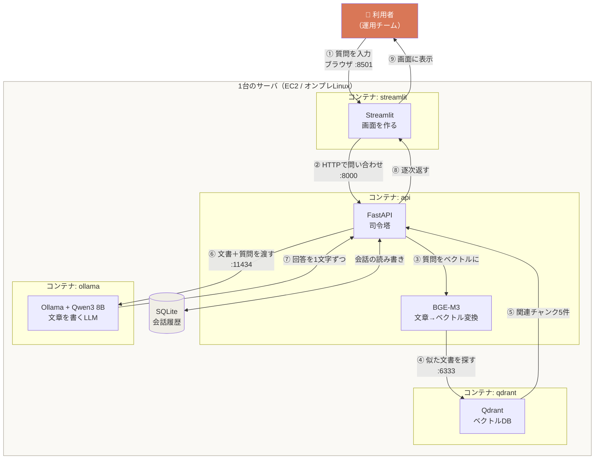
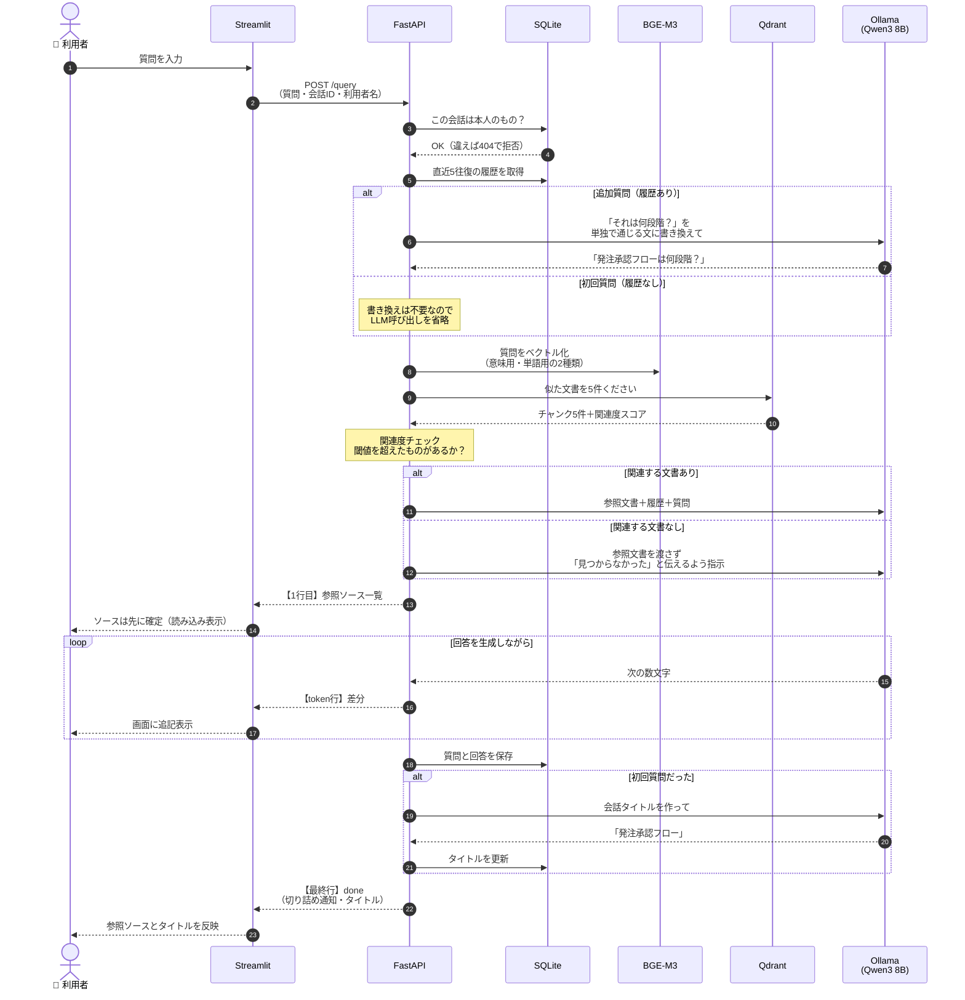
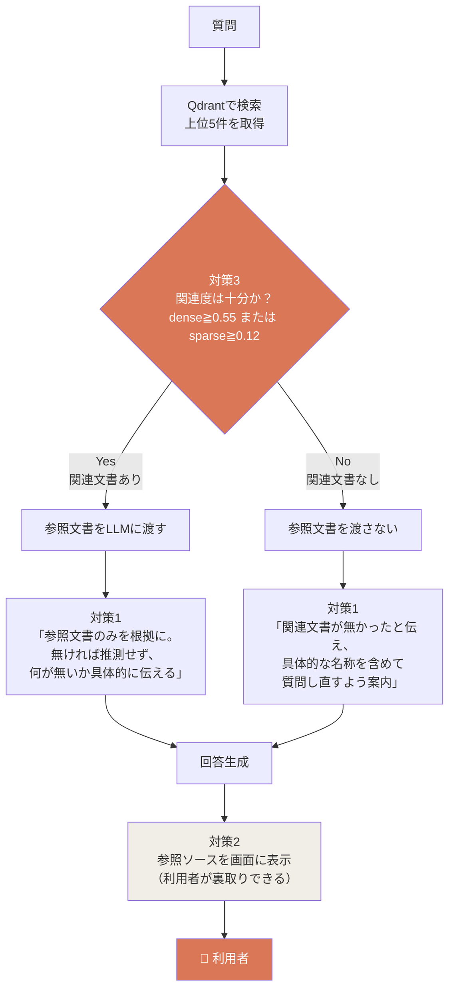
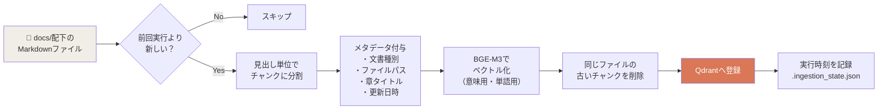
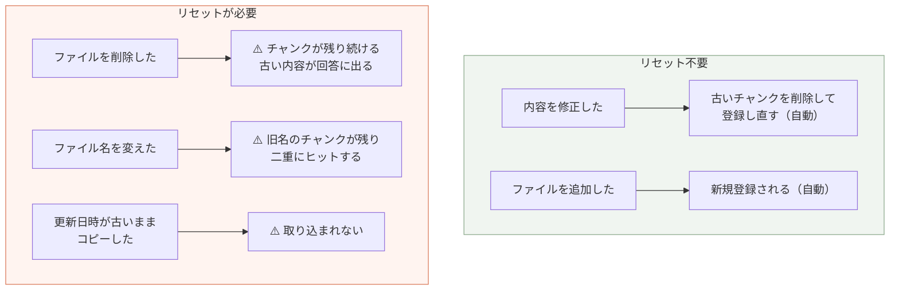
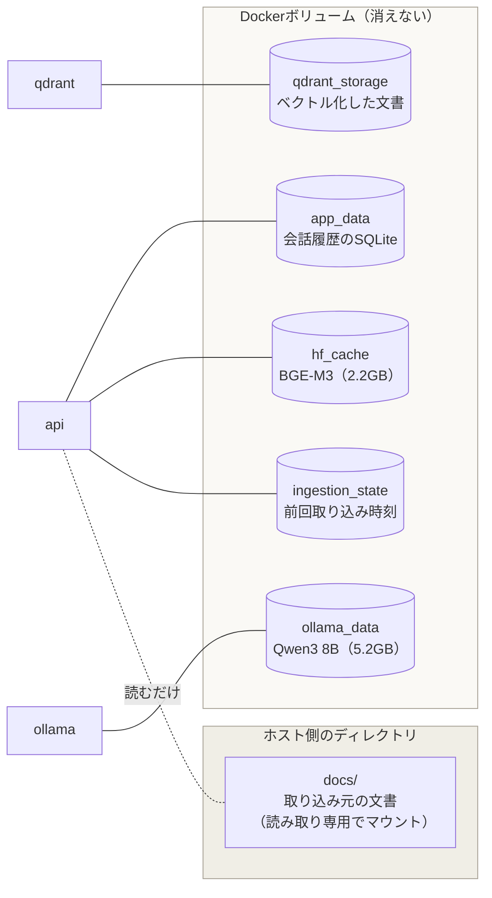
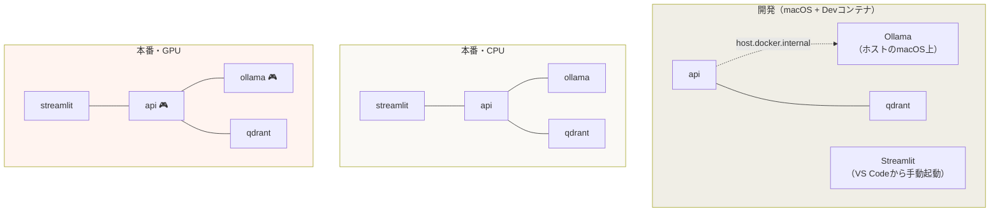

# 構成図

利用者の操作を起点に、各サービスがどう繋がって動くかを図で示す。
仕様書の文章だけでは掴みにくい「実際の流れ」を理解するための資料。

---

## 1. 全体像：どこで何が動いているか

利用者が触るのはブラウザだけで、その裏で4つのサービスが連携している。

### それぞれの役割

| サービス | 役割 | たとえるなら |
|---|---|---|
| **Streamlit** | 画面の描画と入力受付 | 受付窓口 |
| **FastAPI** | 検索と生成の手順を統括 | 司令塔 |
| **BGE-M3** | 文章を数値の並び（ベクトル）に変換 | 翻訳機 |
| **Qdrant** | ベクトルを保管し、似たものを高速に探す | 索引付きの書庫 |
| **Ollama + Qwen3 8B** | 渡された文書をもとに日本語の回答を書く | 書き手 |
| **SQLite** | 会話履歴を保存 | 会話のノート |

> **なぜベクトルにするのか**：「発注の承認は誰がやる？」と「承認フローの承認者」は文字列としては
> 一致しないが、意味は近い。文章を数百次元の数値に変換しておくと、**意味の近さを距離として
> 計算できる**ようになる。これがRAGの検索の土台になっている。

---

## 2. 質問してから回答が出るまで（時系列）

利用者が質問を1回投げたときに、内部で何が順番に起きるか。

### ポイント3つ

**① ソースを先に返している**
参照ソースは検索が終わった時点で確定する。LLMが書き終わるのを待たずに先へ送ることで、
利用者は「何を根拠に答えようとしているか」を早く知ることができる。

**② 保存は回答が終わってから**
質問を先に保存すると、その質問自身が「履歴」として読み込まれてしまう。
そのため保存は最後にまとめて行う。

**③ タイトル生成も最後**
タイトルを作るにはLLMをもう1回呼ぶ必要がある。先に作ると回答の表示が遅くなるため、
回答が出そろってから作り、会話一覧に後から反映する。

---

## 3. ハルシネーション（でっち上げ）を防ぐ仕組み

RAGで最も重要な部分。3つの対策が**直列に**効いている。

| 対策 | 内容 | 防ぐもの |
|---|---|---|
| **対策1** プロンプト設計 | 参照文書だけを根拠にさせる | 一般知識で勝手に答えること |
| **対策2** ソース表示 | 根拠にした文書を画面に出す | 利用者が誤りに気づけないこと |
| **対策3** 関連度の閾値 | 関連の薄い文書を最初から渡さない | 無関係な文書を根拠にすること |

> **なぜ閾値だけで完結させないのか**：関連度の判定は完璧ではない。
> 誤って弾けば「あるはずの答えが出ない」、誤って通せば「無関係な文書で答える」。
> どちらも起きうる前提で、3つを重ねて防いでいる。

### 関連度スコアの読み方

検索結果には2種類のスコアがある。**どちらか一方でも閾値を超えれば「関連あり」**と判定する。

| 種類 | 何を測るか | 得意なこと | 閾値 |
|---|---|---|---|
| **dense**（意味） | 文章の意味の近さ | 言い回しが違っても意味が近いものを拾う | 0.55 |
| **sparse**（単語） | 単語の一致度 | 「E-1005」「PO-202608-0001」など固有の文字列 | 0.12 |

開発用サンプル文書での実測値：

| 質問の種類 | dense | sparse |
|---|---|---|
| 文書に答えがある | 0.62〜0.78 | 0.17〜0.29 |
| 文書に答えがない | 0.45〜0.49 | 0.001〜0.07 |
| 挨拶（「こんにちは」） | 0.42〜0.49 | 0.002〜0.007 |

---

## 4. ドキュメントを取り込むまで（Ingestion）

質問の流れとは**別系統**で、事前に1回行う準備作業。

### なぜ「見出し単位」で切るのか

LLMに渡せる文章量には上限がある。文書を丸ごと渡せないため、あらかじめ小さく切っておき、
質問に関係する部分だけを選んで渡す。このとき**意味のまとまりで切らないと**、
文の途中で切れて内容が通じなくなる。Markdownの見出しは章・節の区切りなので、
そこで切ると内容のまとまりが保たれる。

### 差分取り込みの落とし穴

対処法は [`ドキュメント再取り込み手順.md`](ドキュメント再取り込み手順.md) を参照。

---

## 5. データはどこに保存されるか

コンテナは作り直すと中身が消えるため、消えては困るデータは**ボリューム**に置いている。

| 保存先 | 消えたときの影響 | 復旧方法 |
|---|---|---|
| `qdrant_storage` | 検索できなくなる | 再取り込みで復旧可（時間はかかる） |
| **`app_data`** | **過去の会話が失われる** | **復旧不可。要バックアップ** |
| `ollama_data` | LLMが動かない | 再ダウンロードで復旧可 |
| `hf_cache` | 検索・取り込みができない | 再ダウンロードで復旧可 |
| `ingestion_state` | 次回に全件再取り込みされる | 実害は時間だけ |

> **`docker compose down -v` は使わないこと。** `-v` を付けるとボリュームごと消える。
> 会話履歴だけは復旧手段が無い。

---

## 6. 環境ごとの構成の違い

同じコードを3つの構成で動かしている。

| 環境 | Composeファイル | Ollamaの場所 | 理由 |
|---|---|---|---|
| 開発 | `docker-compose.yml` + `override.yml` | **ホストのmacOS上** | macOSのコンテナからはGPU（Metal）が使えないため |
| 本番CPU | `docker-compose.prod.yml` | コンテナ | |
| 本番GPU | `prod.yml` + `gpu.yml` | コンテナ（GPU割当） | Linux + NVIDIAならコンテナからGPUを使えるため |

> `docker-compose.override.yml` は**macOSの開発環境専用**。本番に持ち込むと
> Ollamaへの接続先が `host.docker.internal` に書き換わり、繋がらなくなる。

---

## 7. 関連ドキュメント

| 目的 | 参照先 |
|---|---|
| 仕様の詳細 | [`仕様書.md`](仕様書.md) |
| プロジェクト全体の入口 | [`../README.md`](../README.md) |
| RAG・LLMの基礎知識 | [`RAG_LLM基礎知識.md`](RAG_LLM基礎知識.md) |
| AWSへのデプロイ | [`デプロイ手順_AWS_EC2_GPU.md`](デプロイ手順_AWS_EC2_GPU.md) |
| オンプレへのデプロイ | [`デプロイ手順_オンプレミス.md`](デプロイ手順_オンプレミス.md) |
| ドキュメントの入れ替え | [`ドキュメント再取り込み手順.md`](ドキュメント再取り込み手順.md) |
